# GAMES101计算机图形学

## chapter1 绪论

#### **应用**

全局光照 风格化 movies 特效 面部捕捉 动画animations 几何表述 渲染  计算光线 模拟\仿真(simulation) 设计(CDA\CG) 仿真(?)  可视化(visualzation) 虚拟现实(vr) digital lllustration(数字插图) GUI Typography(字体) 

#### **内容**

###### 1.rasterization(光栅化)

三维空间的几何形体实时显示在屏幕上

实时：30fps 离线：offline

###### 2.curves and meshes

曲线、曲面

###### 3.ray tracing(光线追踪)

###### 4.animation/simulation

#### **本课程不包含**

opengl/DirectX/vulkan 图形学API

the syntax of shaders

三维建模和游戏开发

计算机视觉cv(猜测、识别)

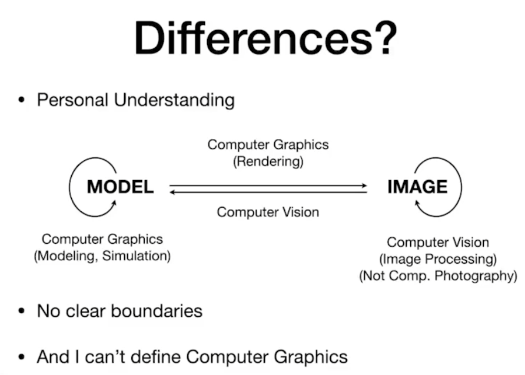

## chapter2 线性代数

​	向量、矩阵

#### dependencies of computer graphics

数学：线性代数、微积分、统计

物理：光学、力学

其他：信号处理、数值分析

美学

#### 向量(矢量)

方向、长度
$$
\vec{AB}=B-A
$$
normalization：单位向量，表示方向

点乘：夹角余弦，结果是一个数 -> **求夹角、投影、向量分解、向前向后（点乘正负）、向量是否接近**

叉乘：
$$
\vec{a}×\vec{b}=-\vec{b}×\vec{a}
$$

$$
||\vec{a}×\vec{b}||=||\vec{a}||||\vec{b}||sinΦ
$$

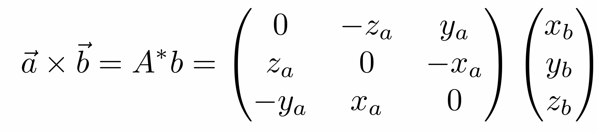

方向和a与b垂直，右手定则确定

叉乘自己是0向量

**建立三维空间直角坐标系、判断左右内外**

叉乘同号判断内外，叉乘正负判断左右

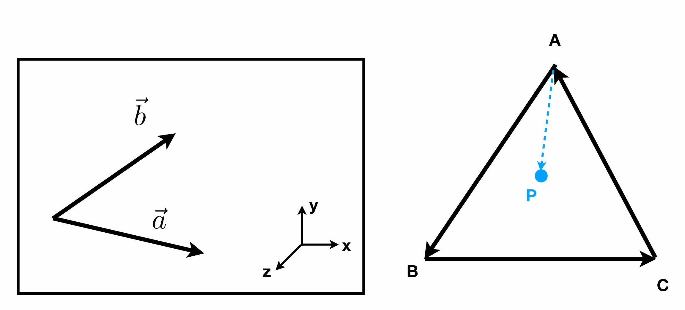

#### 矩阵

无交换律

有结合律和分配律

变换

## chapter3 变换transformer

#### 变换的作用

模型变换

视图变换

旋转，缩放，投影

#### 2D变换

矩阵与变换

一些线性变换

###### 1.缩放 scale

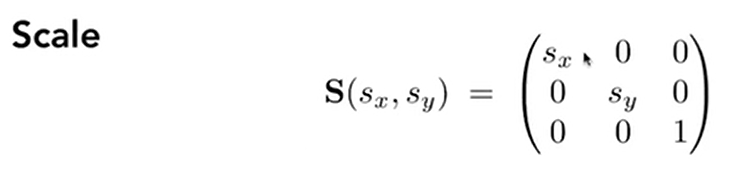

###### 2.翻转 reflection

###### 3.切变 shear

###### 4.旋转

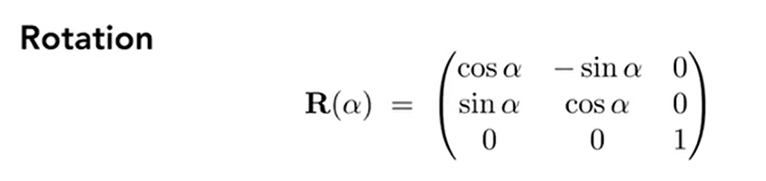

#### 齐次坐标

###### 5.平移变换/仿射变换 translation 不是线性变换

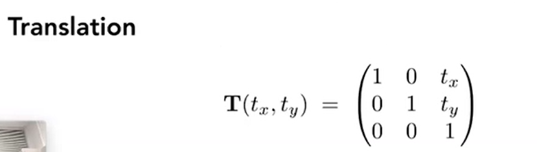

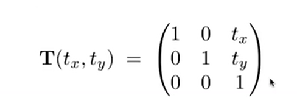

2维向量和点增加一个维度

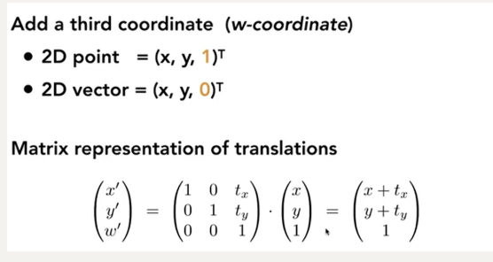

1和0的作用：

0 ->平移不变  点加上点->中点

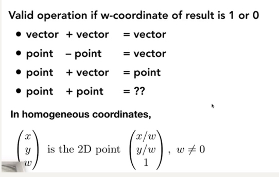

#### 逆变换

逆矩阵

#### 变换合成

复杂变换可以通过一系列简单的变换得到

变换的顺序（矩阵不具有交换律）

#### 变换分解

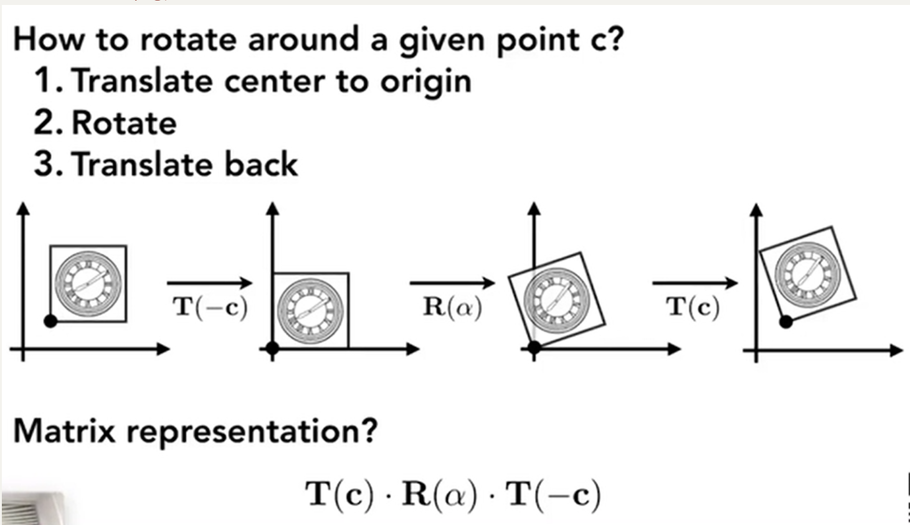

绕C旋转分解

1.移动到原点 2.旋转 3.移动到c点

#### 3D变换

###### 三维空间的齐次表示

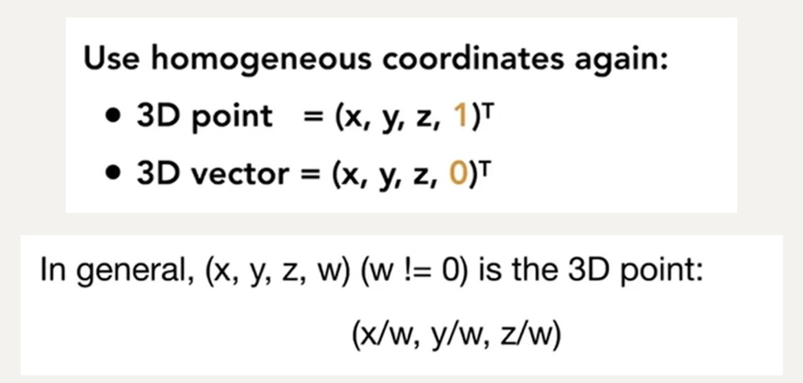

变换

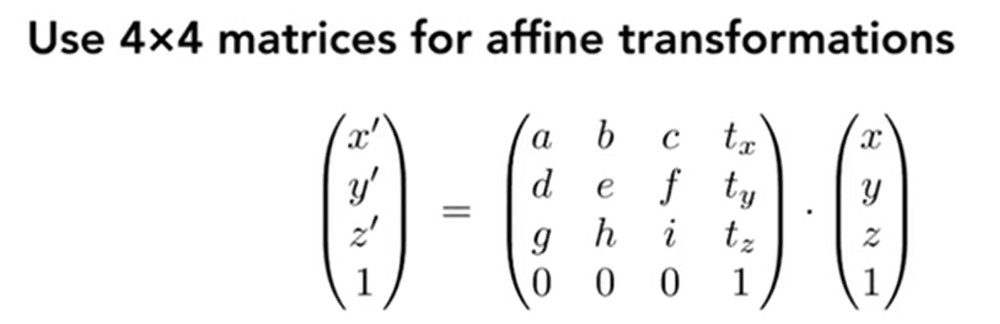

线性变换 放射变换 平移变换

先线性变换再平移，如下图所示分解

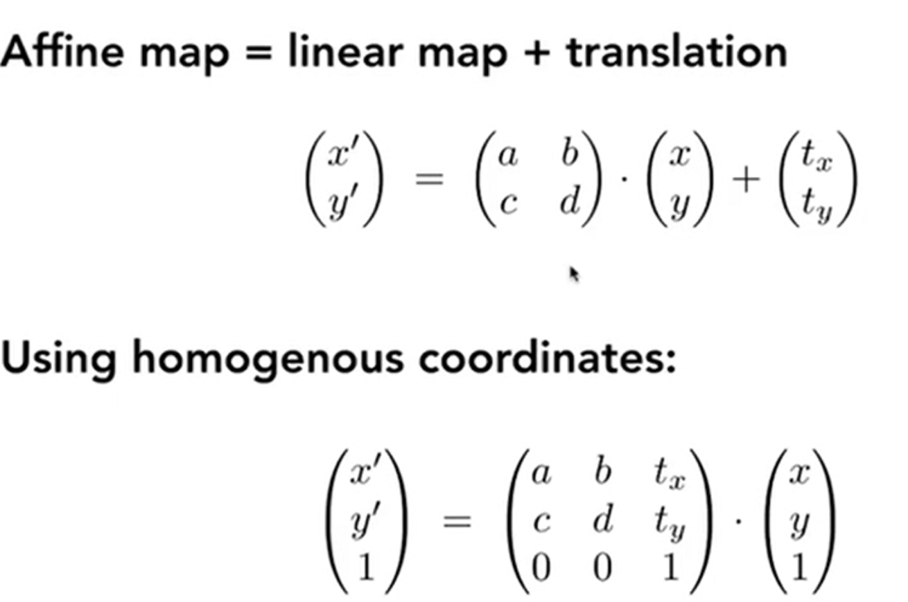

###### scale in 3D

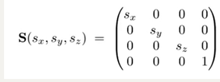

###### translation in 3D

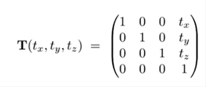

###### rotation in 3D

绕轴旋转：

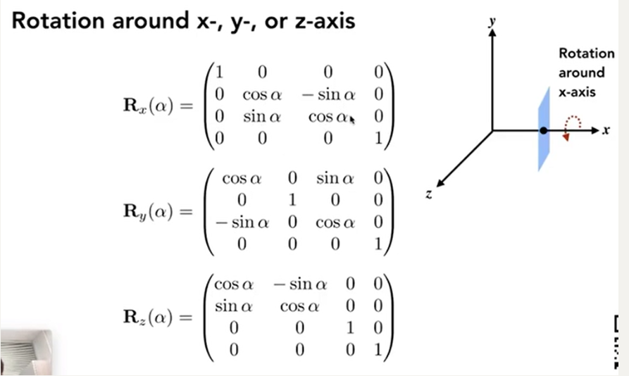

任意旋转

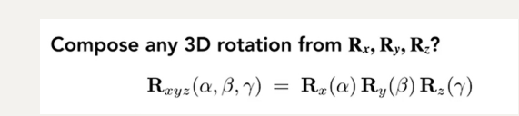

欧拉角

###### 旋转公式:绕轴n旋转角度α

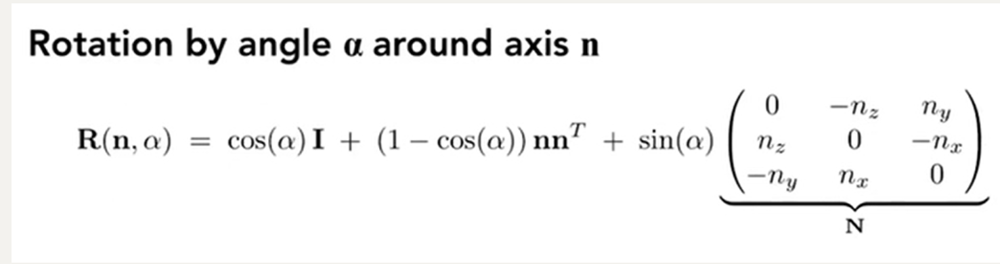

#### 观测变换之视图变换和投影变换 

拍照 

step1 地点和人物model transformation

step2角度和相机view transformation

step3拍照projection transformation

###### model/view/camera transformation

1.确定相机的三个向量：位置 朝向 向上

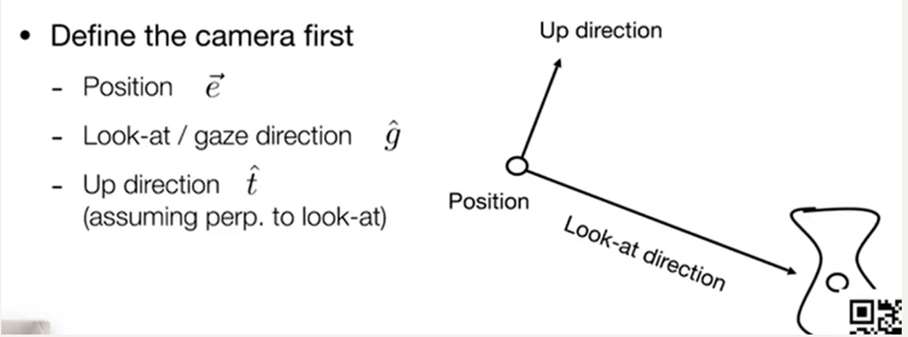

2.移动相机到固定的标准位置上，原点，-z方向看，y向上方向

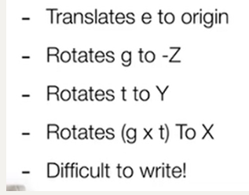

step1：e移动到原点

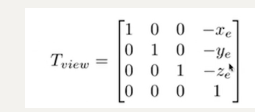

step2:旋转轴，考虑逆旋转(转置)

###### projection transformation

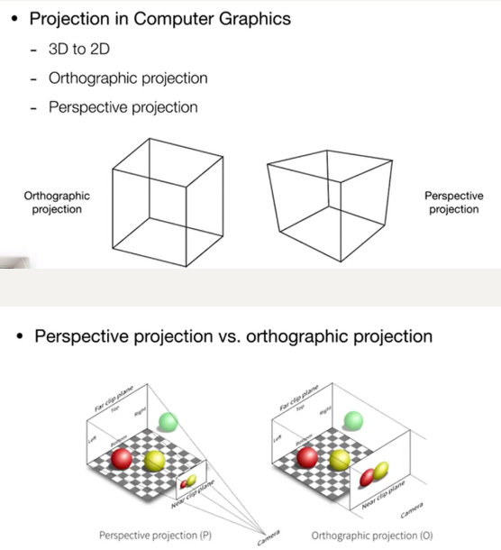

###### 正交投影

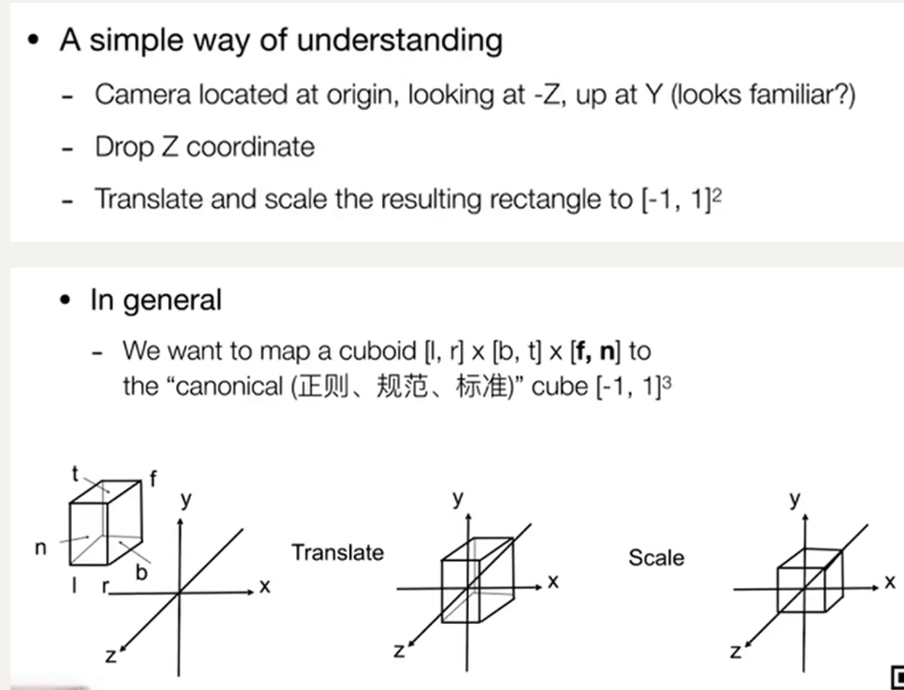

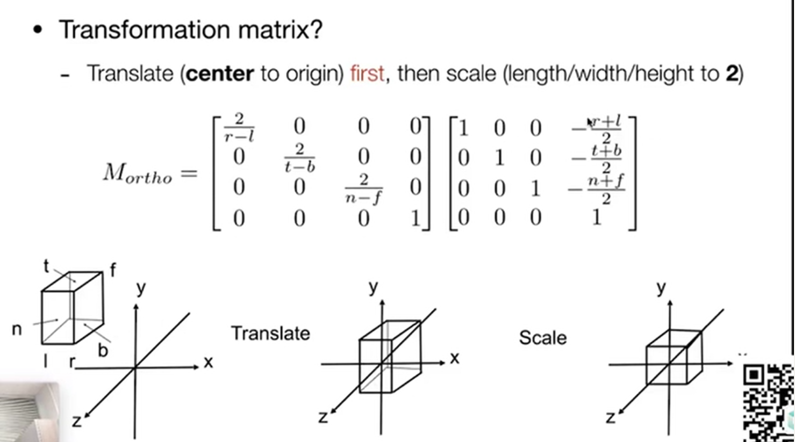

 

###### 透视投影

平行线不再相交

一些数学基础

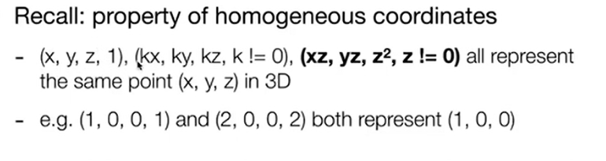

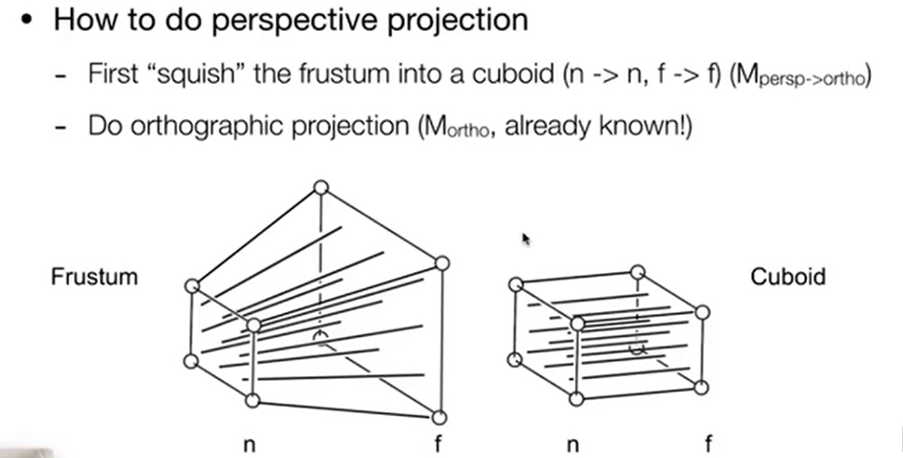

先变成长方体，再做正交投影

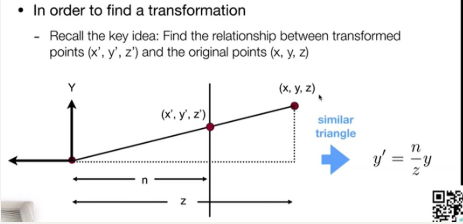

有一个相似三角形的数学关系

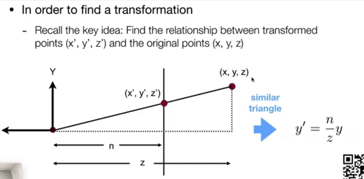

如下计算，来寻找压缩变换的矩阵

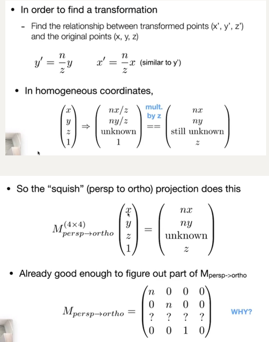

观察到：近和远平面的z不变

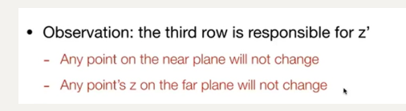

先看近平面上的任意一点在矩阵作用下是自己，对其 变换齐次坐标

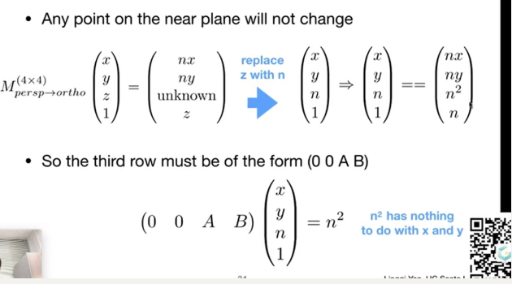

再看远平面的点，考虑中心点

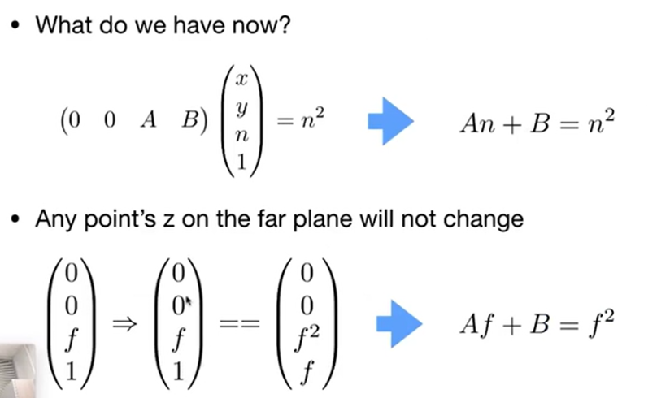

最后解出A和B

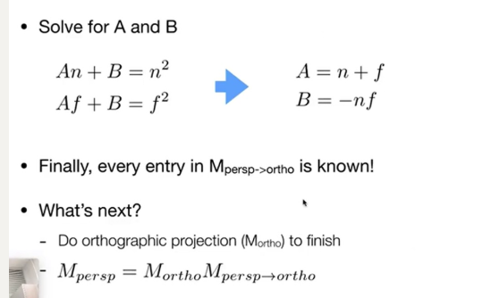

 

