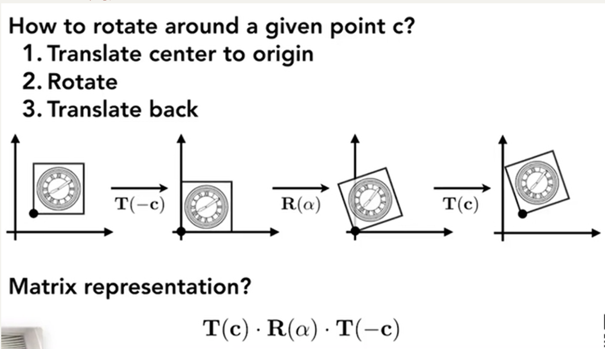
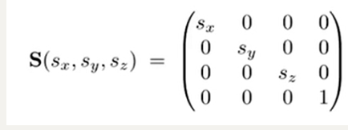
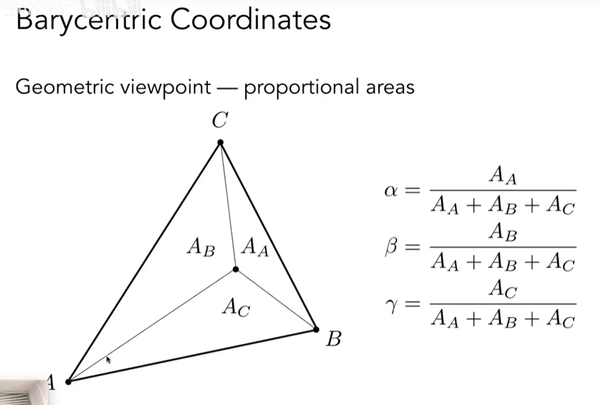
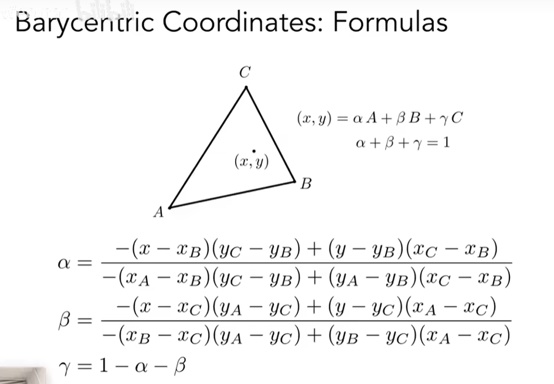
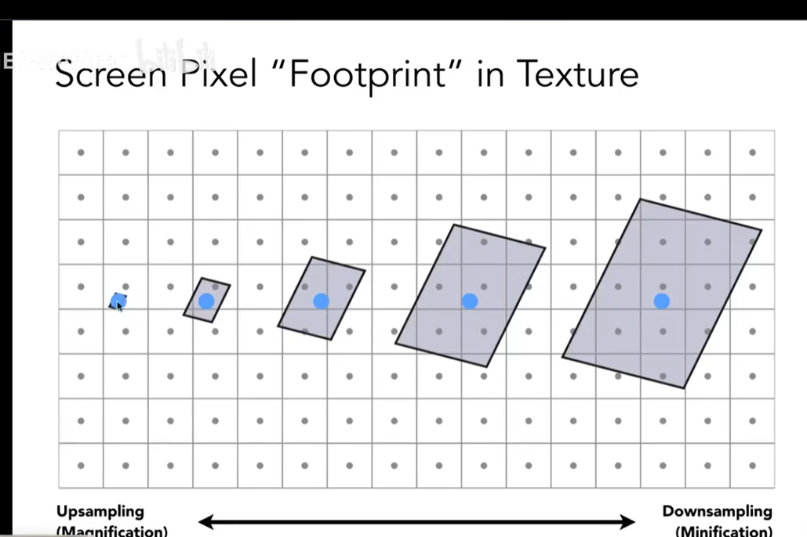

# GAMES101计算机图形学

## chapter1 绪论

#### **应用**

全局光照 风格化 movies 特效 面部捕捉 动画animations 几何表述 渲染  计算光线 模拟\仿真(simulation) 设计(CDA\CG) 仿真(?)  可视化(visualzation) 虚拟现实(vr) digital lllustration(数字插图) GUI Typography(字体) 

#### **内容**

###### 1.rasterization(光栅化)

三维空间的几何形体实时显示在屏幕上

实时：30fps 离线：offline

###### 2.curves and meshes

曲线、曲面

###### 3.ray tracing(光线追踪)

###### 4.animation/simulation

#### **本课程不包含**

opengl/DirectX/vulkan 图形学API

the syntax of shaders

三维建模和游戏开发

计算机视觉cv(猜测、识别)


## chapter2 线性代数

​	向量、矩阵

#### dependencies of computer graphics

数学：线性代数、微积分、统计

物理：光学、力学

其他：信号处理、数值分析

美学

#### 向量(矢量)

方向、长度
$$
\vec{AB}=B-A
$$
normalization：单位向量，表示方向

点乘：夹角余弦，结果是一个数 -> **求夹角、投影、向量分解、向前向后（点乘正负）、向量是否接近**

叉乘：
$$
\vec{a}×\vec{b}=-\vec{b}×\vec{a}
$$

$$
||\vec{a}×\vec{b}||=||\vec{a}||||\vec{b}||sinΦ
$$


方向和a与b垂直，右手定则确定

叉乘自己是0向量

**建立三维空间直角坐标系、判断左右内外**

叉乘同号判断内外，叉乘正负判断左右


#### 矩阵

无交换律

有结合律和分配律

变换


## chapter3 变换transformer

#### 变换的作用

模型变换

视图变换

旋转，缩放，投影

#### 2D变换

矩阵与变换

一些线性变换

###### 1.缩放 scale


###### 2.翻转 reflection

###### 3.切变 shear

###### 4.旋转


#### 齐次坐标

###### 5.平移变换/仿射变换 translation 不是线性变换


2维向量和点增加一个维度


1和0的作用：

0 ->平移不变  点加上点->中点


#### 逆变换

逆矩阵

#### 变换合成

复杂变换可以通过一系列简单的变换得到

变换的顺序（矩阵不具有交换律）

#### 变换分解



绕C旋转分解

1.移动到原点 2.旋转 3.移动到c点

#### 3D变换

###### 三维空间的齐次表示


变换


线性变换 放射变换 平移变换

先线性变换再平移，如下图所示分解


###### scale in 3D



###### translation in 3D


###### rotation in 3D

绕轴旋转：


任意旋转


欧拉角

###### 旋转公式:绕轴n旋转角度α


#### 观测变换之视图变换和投影变换 

拍照 

step1 地点和人物model transformation

step2角度和相机view transformation

step3拍照projection transformation

###### model/view/camera transformation

1.确定相机的三个向量：位置 朝向 向上


2.移动相机到固定的标准位置上，原点，-z方向看，y向上方向


step1：e移动到原点


step2:旋转轴，考虑逆旋转(转置)


###### projection transformation


###### 正交投影


 

###### 透视投影

平行线不再相交

一些数学基础


先变成长方体，再做正交投影


有一个相似三角形的数学关系


如下计算，来寻找压缩变换的矩阵


观察到：近和远平面的z不变


先看近平面上的任意一点在矩阵作用下是自己，对其 变换齐次坐标


再看远平面的点，考虑中心点


最后解出A和B


## chapter4 光栅化Rasterization/三角形

复习：perspective projection


长宽比（宽高比）aspect ratio和垂直可视角度Y 作业1会用到


做完三个步骤后，所有的物体都会在[-1,1]³中


接下来会讲正交立方体放到屏幕上


##### 光栅化：将物体画在屏幕上

屏幕：像素的排列，是典型的栅格

分辨率：像素排列的大小

像素：有颜色的小方格，颜色由RGB三色组成

##### 定义屏幕空间

像素的坐标indices，整数坐标，(0,0) to (width-1,height-1)

像素中心(x+0.5,y+0.5)，覆盖(0,0) to (width,height)

原点在屏幕空间的左下角


##### 立方体变换到屏幕上

先把立方体的xy平面缩放到屏幕上

再平移（保证原点在左下角）

也就是视口变换，变化的矩阵如下所示

这样我们得到一个2维的图


​    
$$
\[     x_{\text{screen}} = \left(\frac{x_{\text{NDC}} + 1}{2}\right) \times \text{width}     \]
$$
​     
$$
\[     y_{\text{screen}} = \left(\frac{y_{\text{NDC}} + 1}{2}\right) \times \text{height}     \]
$$

$$
\[     z_{\text{screen}} = \left(\frac{z_{\text{NDC}} + 1}{2}\right) \times \text{depth}     \]
$$


##### 把三角形坐标变成屏幕空间的像素

drawing machines

###### 一些成像设备

光栅显示设备:示波器，显示器（显存，内存中的一个区域），LCD（计算器，手机，视网膜级别）,电子墨水屏

LCD，液晶显示器

LED，发光二极管

###### 三角形

最简单的多边形，能表示别的多边形，确定一个平面

内部外部对应清楚，渐变性质（插值）

像素中心点和三角形的位置关系

###### **采样，sampling ：**

在某个点对函数求值就是采样，我们通过采样将函数离散化。

###### **计算一个函数在某个点的值**

**离散化某个函数**

如对像素中心采样，对时间，空间采样


用叉乘判断是否在内部，同为正或者同为负

边界情况：不做处理或者特殊处理


锯齿？

抗锯齿和反走样

##### sampling artifacts(瑕疵？)

Aliasing/Jaggies 空间采样

摩尔纹 空间采样

车轮效应 时间采样

##### 时域与频域

频域是描述信号在频率方面特性时用到的一种坐标系

时域是描述数学函数或物理信号对时间的关系的一种坐标系。


信号变换速度大于采样速度 和频率有关 数字信号


模糊/滤波信号 用于抗锯齿和反走样


定义 频率f 周期T

傅里叶级数展开：周期函数写成正弦余弦函数的线性组合加常数

随着展开式越来越多，越来越接近我们想要表达的函数


傅里叶变换：在时域和频域之间转换信号的技术


随着频率越高，采样效果越差

走样：不同的函数在一个采样方法下得到相同的结果

##### 滤波：去掉一些频率的内容

时域到频域


右边是频率内容

中间低频，四周高频


高通滤波  信号变化很大-高频率-边界


低通滤波 边界变得很模糊


###### 滤波=卷积=平均 


任意个数=周围数加权平均


滤波器，卷积核


归一化的九分之一

###### 采样=重复频域上的内容


冲激函数

采样=重复频谱

为什么会走样


采样率不够，频谱的复制粘贴的间隔越小，发生了混合

##### 如何反走样？

1.增加采样率 频率高 增加分辨率

2.先模糊，再采样

低通滤波（模糊）


##### 

在光栅化一个三角形时，像素颜色的平均值f（x,y）= 三角形的覆盖像素的面积

##### 实际做法

###### MSAA：模糊和滤波操作，不是提高采样率

一个像素划分成更多的小像素，然后每个判断，然后取平均，覆盖率


模糊效果如上，然后进行采样

代价：计算量

**采样点可以用不同的图案，也可以复用


###### FXAA 方案 边界处理

###### TAA方案 

###### 超分辨率


## chapter4 shading着色

##### 可见性与遮挡 Z-buffering

很多物体显示在屏幕上，先后顺序与覆盖（作业2)

画家算法（油画家）:先画远的，把远处的先光栅化


深度从远到近进行排序 n个三角形O(nlogn)复杂度

问题：遮挡关系形成了一个环


##### 解决：z-buffer  深度缓存算法

对每个像素进行分析和记录


frame buffer：颜色（图像）

depth buffer：深度信息

简化计算，把z改成正的


越近越黑，越远越白

```
initialize depth buffer to ∞
during rasterization：
for(each triangle T)//每个三角形
	for(each sample (x,y,z) in T)//每个三角形的采样点
		if(z＜zbuffer[x,y])//如果离屏幕更近
		{
			framebuffer[x,y]=rgb;//更新颜色
			zbuffer[x,y]=z;//更新当前深度
		}
	else ;
```

复杂度：O(n)对n个三角形，没有排序，所以是线性时间

假设前提：两个三角形的在同一点的深度不同

维护对了z-buffer，就和顺序无关

example：


MASS情况下：对每个采样点划分四块分别做深度缓存

Z-buffer处理不了透明物体

##### 小结


还差的就是着色（阴影\光照）

##### 着色shading

定义：对不同的物体应用不同的材质

example:


光源在右上，高光，漫反射部分，间接光照

##### 定义与着色有关的一些量：


shading point 反射点

视线方向viewer direction 单位向量v

法线 surface normal 单位向量n

光线方向 light direction 单位向量l

表面参数surface parameters 颜色，shininess等等


局部光照，看不到阴影

##### blinn-phong reflection model 反射/着色模型

###### 漫反射项 diffuse


均匀反射

到达光照


发送光照


平方反比衰减

漫反射的公式


反射率(漫反射系数) 发送比例 到达比例

发射率为1的时候 都反射出去，没有吸收

漫反射是均匀反射，所以和v没关系（在任意角度看是一样的）


###### 高光项specular/blinn-phong


反射方向r接近镜面反射

v和反射方向r接近就看得到高光项


半程向量h是v和l的中线（？）

v和r方向接近等价于h和n接近

镜面反射系数Ks 亮度


p次方的结果：离得稍微偏离，高光就失去，p一般是100-200


###### 间接（环境）光照ambient


假设环境光为Ia，为一个常数，近似得到，和l与v没关系

保证没有地方是黑色的

###### 总结：


##### shading frequencies 着色频率


平面-shading points 插值

- **flat shading**：每个三角形有一个法向量，进行着色，三角形内部各处着色相同
- **Gouraud shading**：每个顶点有一个法向量，进行着色，三角形内部颜色通过插值计算出
- **Phong shading**：每个顶点有一个法向量，通过插值计算出三角形内每个像素的法向量，再对每个像素进行着色


几何越复杂，可以用更简单的方法


顶点的相邻面的法线的加权平均---顶点的法线


##### 实时渲染管线Graphics(Real-time Rendering Pipeline)

**图形管线（graphics pipeline）**，或者称为**实时渲染管线（real-time rendering pipeline）**，是指通过给定虚拟相机，3D场景物体，光源等要素来生产或者渲染一副2D 图像的过程。如图：

场景到最后一张图


##### 像素着色器


##### texture mapping纹理映射

**纹理映射（texture mapping）**就是把一张2维的图像贴（映射）到一个三维物体表面。三维物体上每个三角形顶点对应二维纹理的一个坐标(u,v)。

至于怎么映射、以及纹理如何设计，我们不关心。


定义任何位置上的所以属性

任何物体是=的表面是2维的


纹理无缝衔接

 

##### 重心坐标

为了做三角形内部的插值

why？三角形顶点的属性值（纹理映射，颜色），平滑过渡计算三角形内部的值

定义：


examples 重心坐标


面积比计算任意一点的中心坐标



三角形自己的重心




用坐标计算重心坐标


使用中心坐标进行插值


问题：投影坐标下不能保证重心坐标不变

所以在三维空间中进行插值，再进行投影

##### 利用重心坐标计算纹理

把纹理应用到物体过程为：

- 对于每个采样点（像素中心），可以通过重心坐标插值得到纹理对应(u,v)坐标。原来我们只知道顶点对应的(u,v)坐标，现在通过插值得到所有采样点的了。
- 获取材质(u,v)坐标的颜色，并设置该采样点的漫反射系数Kd即可


###### 纹理映射的问题

- **纹理放大（texture magnification）**：当纹理图片分辨率过低，就会出现多个像素点仍然对应一个(u,v)坐标，并将该(u,v)坐标下颜色信息复制给该像素点，这样形成的图片边界过渡就会非常不自然，形成一个个的小格子（图Nearest）。
- **纹理缩小（texture minification）**：纹理分辨率过高，就会出现一个像素点对应多个(u,v)坐标，便会导致走样的问题。

###### Texture Magnification

texel 纹理上的一个像素


双三次插值bicubic 取周围的16个

事实上，在纹理被放大和缩小时都可以使用nearest、bilinear或bicubic的做法。这称为**纹理滤波（texture filtering）**。

###### Texture Minification

形成摩尔纹+锯齿

像素覆盖很多纹理空间的像素




可以使用**超采样（supersampling）**解决，但是计算昂贵。

###### **Mipmap**概念，可以实现快、近似、正方形的**范围查询（range query）**——可以立刻得到一个区域内的平均值（或最大值、最小值等）。

利用原始纹理，预处理生成mipmap。额外存储其实只有原图的三分之一，不占多少空间。


图像金字塔：


近似计算在第几层可以缩小成一个像素，查找第几层的midmap


但是得到的结果不连续->插值

假设我算出来是1.8层，还需要使用**三线性插值（trilinear interpolation）**（两次双线性插值后，再做一次线性插值）来得到屏幕像素的最终值：

插值结果：


###### midmap的缺点

然而由于mipmap只实现正方形内的范围查找，于是会产生overblur的问题：（屏幕像素对应材质的长方形甚至斜长的区域，在做mipmap时，自然会取过大的正方形，从而导致模糊的情况）

各向异性过滤-对矩形的区域的查询


EWA过滤


######  Applications of Textures

Environment Map

可以使用纹理来表示环境光，如图：


Bump Mapping

**凹凸贴图（bump mapping）**可以记录物体表面相对高度，从而影响物体表面法线，进而影响阴影，给人凹凸感觉。不过物体表面实际上还是光滑的，凹凸只是纹理带来的错觉。


**位移贴图（displacement mapping）**则真正移动了3Dmesh的顶点，从而有更真实的阴影效果。但是要求物体的3D mesh要足够细，才能支持这个操作。

**3D Procedural Noise**

引入噪声，来生成3维纹理（譬如大理石纹路之类的）。

**Provide Precomputed Shading**

就是在纹理上已经做好shading了

**3D Textures**

纹理可以不只是二维表面的，也可以是三维空间的。还可以做**体渲染（volume rendering）**。譬如CT扫描的结果。


  


 


