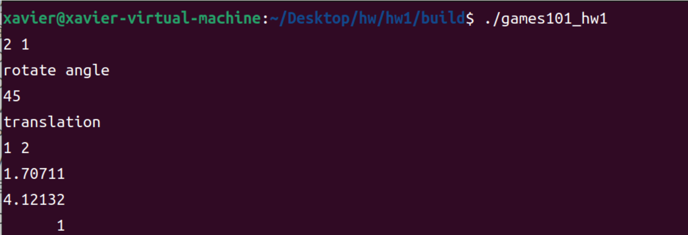

## games101 作业

#### 配置环境

ubuntu/vscode/c++/opencv/c++

很麻烦，有空再补充

#### HW1-0

这个作业主要是熟悉和了解Eigen库中的一些基本操作

头文件：

```c++
#include<cmath>
#include<eigen3/Eigen/Core>
#include<eigen3/Eigen/Dense>
#include<iostream>
```

构建一个向量

```c++
Eigen::Vector3f v(1.0f,2.0f,3.0f);
Eigen::Vector3f w(1.0f,0.0f,0.0f);
```

构建一个矩阵

```c++
 Eigen::Matrix3f i,j;
    i << 1.0, 2.0, 3.0, 4.0, 5.0, 6.0, 7.0, 8.0, 9.0;
    j << 2.0, 3.0, 1.0, 4.0, 6.0, 5.0, 9.0, 7.0, 8.0;
```

接着就是向量和矩阵的运算，这个很简单

之后是计算一个点旋转和平移后的坐标

我这里多写了一点：输入点的坐标，输入旋转角度，输入平移距离，然后输出结果

##### 流程：

###### 1.编写代码，main .cpp

代码内容比较简单就不贴了，主要是一些向量矩阵操作

###### 2.编写cmakelists，CMakeLists.txt

还待学习

```cmake
# 设置CMake所需的最低版本为3.17
cmake_minimum_required(VERSION 3.17)

# 创建一个名为games101_hw1的项目
project(games101_hw1)

# 查找Eigen3库，如果未找到则报错
find_package(Eigen3 REQUIRED)

# 将Eigen3的头文件目录添加到包含目录中
include_directories(${EIGEN3_INCLUDE_DIR})

# 设置C++标准为C++11
set(CMAKE_CXX_STANDARD 11)

# 添加一个可执行文件，目标名为games101_hw1，源文件为main.cpp
add_executable(games101_hw1 main.cpp)
```


###### 3编译:

在终端

```bash
mkdir build

cd build

cmake ..

make    
//编译程序

./games101_hw1 
//运行编译结果，可执行文件由cmakelists里面确定
```

###### 结果




hw1-1

实现控制三角形绕z轴和任意轴旋转

主要是阅读理解和补全代码

##### 1.camera/view/model transformation

```c++
Eigen::Matrix4f get_view_matrix(Eigen::Vector3f eye_pos) //get view matrix, use vector eye_pos as parameter
{
    Eigen::Matrix4f view = Eigen::Matrix4f::Identity();//get an identity matrix view

    Eigen::Matrix4f translate;                          
    translate << 1, 0, 0, -eye_pos[0], 
    0, 1, 0, -eye_pos[1], 
    0, 0, 1,-eye_pos[2], 
    0, 0, 0, 1;

    view = translate * view;

    return view;
}
```

##### 2.绕z轴旋转

```c++
Eigen::Matrix4f get_model_matrix(float rotation_angle)
{
    Eigen::Matrix4f model = Eigen::Matrix4f::Identity();

    // TODO: Implement this function
    // Create the model matrix for rotating the triangle around the Z axis.
    // Then return it.
    model(0,0)=std::cos(rotation_angle/180.0*MY_PI);
    model(0,1)=-std::sin(rotation_angle/180.0*MY_PI);
    model(1,0)=std::sin(rotation_angle/180.0*MY_PI);
    model(1,1)=std::cos(rotation_angle/180.0*MY_PI);

    return model;
}
```


##### 3.绕任意轴旋转

```c++
Eigen::Matrix4f get_rotation(Eigen::Vector3f axis, float angle)//
{
    float rangle=angle/180.0f*MY_PI;
    Eigen::Matrix3f R=Eigen::Matrix3f::Zero();
    Eigen::Matrix3f I=Eigen::Matrix3f::Identity();
    Eigen::Matrix3f temp;
    temp<<0,-axis[2],axis[1],
    axis[2],0,-axis[0],
    -axis[1],axis[0],0;
    R=std::cos(rangle)*I+(1-std::cos(rangle))*axis*axis.transpose()+std::sin(rangle)*temp;
    Eigen::Matrix4f model;
    model<<R(0,0),R(0,1),R(0,2),0.0f,
    R(1,0),R(1,1),R(1,2),0.0f,
    R(2,0),R(2,1),R(2,2),0.0f,
    0.0f,0.0f,0.0f,1.0f;

    return model;

}
```

##### 4，projection transformation

```c++

Eigen::Matrix4f get_projection_matrix(float eye_fov, float aspect_ratio,
                                      float zNear, float zFar)
{
    // Students will implement this function

    Eigen::Matrix4f projection = Eigen::Matrix4f::Identity();
    Eigen::Matrix4f persp_ortho = Eigen::Matrix4f::Identity();
    Eigen::Matrix4f ortho = Eigen::Matrix4f::Identity();
    Eigen::Matrix4f ortho1 = Eigen::Matrix4f::Identity();
    Eigen::Matrix4f ortho2 = Eigen::Matrix4f::Identity();

    persp_ortho(0,0)=zNear;
    persp_ortho(1,1)=zNear;
    persp_ortho(2,2)=zNear+zFar;
    persp_ortho(2,3)=-zNear*zFar;
    persp_ortho(3,2)=1.0f;
    persp_ortho(3,3)=0.0f;

    // 计算正交投影矩阵的参数
    float fov_radians = eye_fov * MY_PI / 180.0f; // 将角度转换为弧度
    float top = -zNear * std::tan(fov_radians / 2.0f); // 上边界
    float bottom = -top; // 下边界
    float right = top * aspect_ratio; // 右边界
    float left = -right; // 左边界

    //translate
    ortho2(0,3)=-(right+left)/2;
    ortho2(1,3)=-(top+bottom)/2;
    ortho2(2,3)=-(zNear+zFar)/2;

    //scale
    ortho1(0,0)=2/(right-left);
    ortho1(1,1)=2/(top-bottom);
    ortho1(2,2)=2/(zNear-zFar);

    projection=ortho1*ortho2*persp_ortho;


    // TODO: Implement this function
    // Create the projection matrix for the given parameters.
    // Then return it.

    return projection;
}
```

增加了点判断逻辑，判断是绕z轴旋转还是绕任意轴旋转，并输入任意轴

不知道为什么

会报错

```bash
./Rasterizer: symbol lookup error: /snap/core20/current/lib/x86_64-linux-gnu/libpthread.so.0: undefined symbol: __libc_pthread_init, version GLIBC_PRIVATE
```

要加上下面这段代码才能运行

```bash
unset GTK_PATH
```

##### 结果：

绕z轴旋转


绕1，0，0旋转


绕3，4，5旋转


